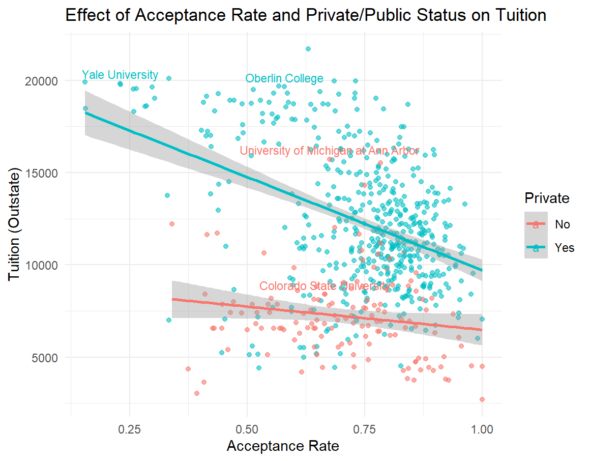

# University Tuition Analysis

This repository demonstrates an analysis of university tuition rates using R. The analysis examines the effect of the acceptance rate, private/public status, and other variables on out-of-state tuition.

## Table of Contents
- [Requirements](#requirements)
- [Dataset](#dataset)
- [Steps](#steps)
- [Code Explanation](#code-explanation)
- [Output](#output)

## Requirements
To run this code, you need the following R libraries:

```r
install.packages("readxl")
install.packages("ggplot2")
```

## Dataset
The analysis requires a dataset named `uni.xlsx`. This dataset should include columns:
- `Grad.Rate`: Graduation rate.
- `Apps`: Number of applications.
- `Accept`: Number of acceptances.
- `F.Undergrad`: Number of full-time undergraduates.
- `Outstate`: Out-of-state tuition.
- `Expend`: Expenditures.
- `S.F.Ratio`: Student-faculty ratio.
- `Private`: Indicator for private/public university (categorical).
- `University`: Names of universities.

## Steps
1. **Read and Filter Data**: Load the dataset and filter universities with a graduation rate greater than 50.
2. **Data Cleaning**: Remove missing values and convert relevant columns to numeric.
3. **Model Fitting**: Fit a linear model to predict out-of-state tuition using selected variables.
4. **Visualization**: Create scatterplots to visualize relationships, highlighting specific universities.

## Code Explanation

### Load Libraries
```r
library(readxl)
library(ggplot2)
```

### Read and Filter Data
```r
uni <- read_excel("uni.xlsx")
uni <- subset(uni, Grad.Rate > 50)
uni <- na.omit(uni)
```

### Data Cleaning
```r
uni$Apps <- as.numeric(uni$Apps)
uni$Accept <- as.numeric(uni$Accept)
uni$F.Undergrad <- as.numeric(uni$F.Undergrad)
uni$Outstate <- as.numeric(uni$Outstate)
uni$Expend <- as.numeric(uni$Expend)
uni$App.Rate <- uni$Accept / uni$Apps
```

### Model Fitting
```r
model <- lm(Outstate ~ App.Rate + Private + Expend + Grad.Rate + S.F.Ratio + Private:Expend, data = uni)
summary(model)
```

### Visualization
#### General Scatterplot
```r
ggplot(uni, aes(x = App.Rate, y = Outstate, color = Private)) +
  geom_point(alpha = 0.6) +
  geom_smooth(method = "lm", se = TRUE) +
  labs(
    title = "Effect of Acceptance Rate and Private/Public Status on Tuition",
    x = "Acceptance Rate",
    y = "Tuition (Outstate)"
  ) +
  theme_minimal()
```

#### Highlight Specific Universities
```r
uni$University <- as.character(uni$University)

ggplot(uni, aes(x = App.Rate, y = Outstate, color = Private)) +
  geom_point(alpha = 0.6) +
  geom_smooth(method = "lm", se = TRUE) +
  labs(
    title = "Effect of Acceptance Rate and Private/Public Status on Tuition",
    x = "Acceptance Rate",
    y = "Tuition (Outstate)"
  ) +
  theme_minimal() +
  geom_text(
    data = subset(uni, University %in% c("University of Michigan at Ann Arbor", "Colorado State University", "Yale University", "Oberlin College")),
    aes(label = University),
    nudge_y = 500,
    check_overlap = TRUE,
    size = 3
  )
```

## Output
The analysis generates:
1. A summary of the linear regression model to understand the effects of various predictors on tuition.
2. Scatterplots illustrating the relationships between acceptance rate, private/public status, and tuition, with specific universities highlighted.

### Example Plot


